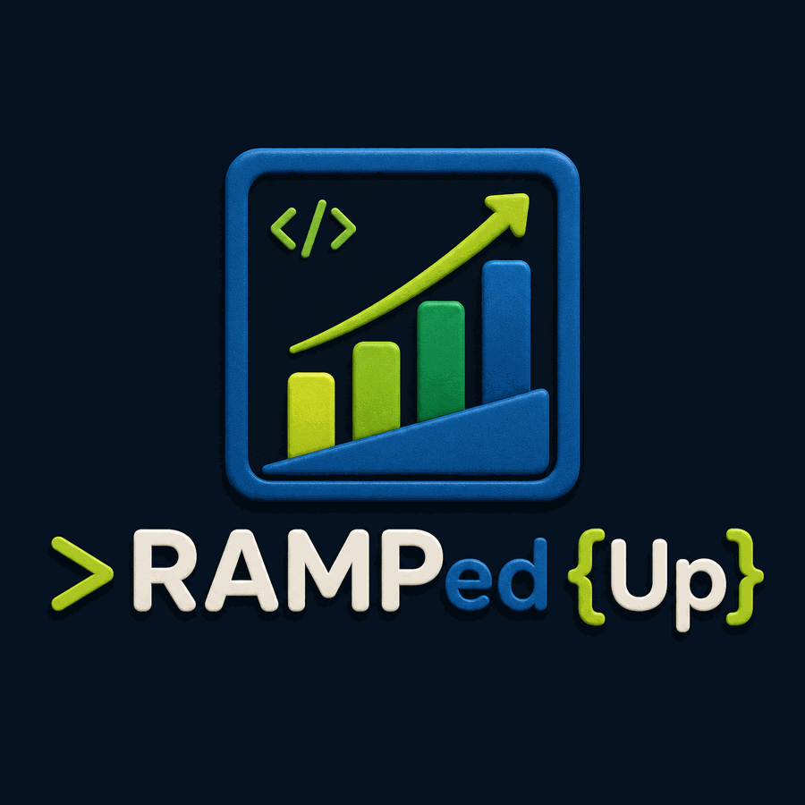

<h1 align="center">RAMPed Up by Diver Dan</h1>

 A very useful tool for customizing the look of code editors and IDEs with minimal json/settings file coding

# Advanced-Color-Ramp-by-Dan
Prototype 2. 
Massive update. Must have for devs who like customization in their IDEs and editors.

# Now the program gives you color palletes based on: 

-Lights
-Darks
-Accents

# You can change the way the color palletes generate with the following options:

-Accent Harmony 
1. Monochromatic
2. Complimentary
3. Analogous 
4. Triadic
5. Split-complimentary 
6. Tetradic 

-A lock mechanism that allows you to freeze a color on a swatch that you like, and regenerate the swatch without losing that color.

-'Unlock All' button to unfreeze the colors you have locked

-Curve swap
1. Ease Out 
2. Ease In
3. Linear 
4. Ease In Out 

-Step quantity dropdown menu: change the amount of colors in a pallete from 3-12

And the best par is that if you are a developer trying to tweak your code editor style and syntax, you can just select the language and it will give you the ENTIRE code block you need to copy and paste directly into your code editor's json and theme files. 

# Working on adding more languages and file types. Currently, the file types supporting this feature are:

-CSS Vars

-Tailwind

-JSON

-SCSS
